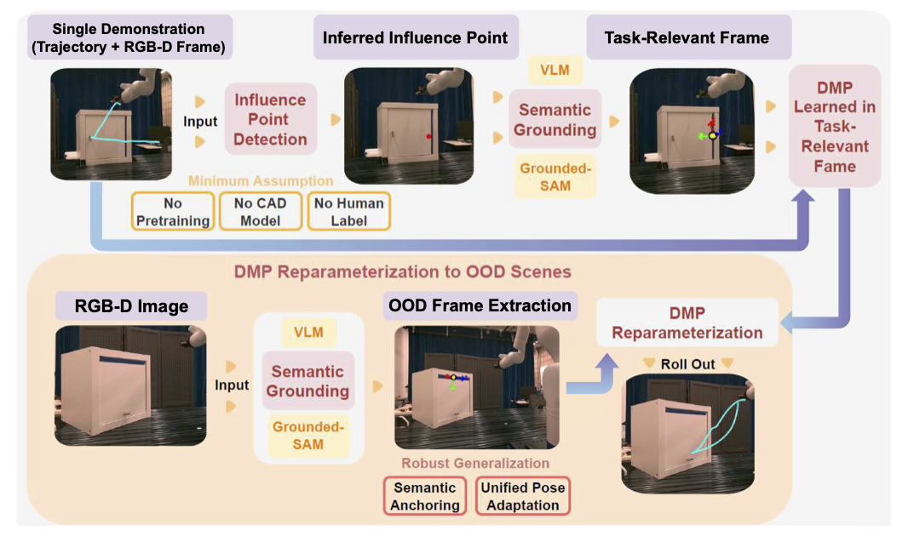

# TReF-6: Inferring Task-Relevant Frames from a Single Demonstration

[[Paper]](https://arxiv.org/pdf/2509.00310)

[Yuxuan Ding]()<sup>1</sup>,
[Shuangge Wang]()<sup>1</sup>,
[Tesca Fitzgerald]()<sup>1</sup>,

<sup>1</sup>Yale University

TReF-6 is a framework for **one-shot skill generalization** in robot manipulation.  
It infers a **task-relevant 6-DoF frame** from a single demonstration, enabling motion primitives (e.g., DMPs) to adapt robustly across novel object poses and scene configurations.




---

## 🛠 Installation

```bash
git clone https://github.com/iqr-lab/tref-6.git
cd tref-6
python3 -m venv tref-env
source tref-env/bin/activate
pip install --upgrade pip
pip install -e .
```

For development:

```bash
pip install -e ".[dev]"
```

---

## 🚀 Quick Start

Run a demo in simulation:

```bash
python examples/run_demo.py --task door_opening --policy dmp
```

Train and evaluate with configuration files:

```bash
python examples/train.py --config-name door_opening_baseline.yaml
python examples/eval.py --checkpoint outputs/.../latest.ckpt --task door_opening
```

---

## 📂 Repository Structure

```
tref-6/
├── tref/                   # Core library
│   ├── tasks/              # Task definitions (datasets, environments)
│   ├── policies/           # Policy abstractions (e.g., DMPs)
│   ├── runners/            # Execution/training loops
│   └── utils/              # Shared utilities
├── configs/                # Hydra-based configs
├── examples/               # Training/evaluation scripts
├── tests/                  # Unit tests
└── docs/                   # Documentation
```

---

## 🧠 Method Overview

TReF-6 consists of three stages:

1. **Influence Point Inference**  
   Optimize a *directional consistency score* to find the spatial point best explaining trajectory dynamics.

2. **Semantic Grounding**  
   Align the inferred point with visual features identified by a VLM, then extract a full 6-DoF frame using surface normals and interaction directions.

3. **DMP Reparameterization**  
   Transform the trajectory into the new frame and fit DMPs over relative motions, allowing reuse in new scenes.

```text
Trajectory → Influence Point → Local Frame → DMP Fitting → Generalized Motion
```

---

## 📊 Logging & Visualization

TReF-6 integrates with [Weights & Biases](https://wandb.ai):

```bash
wandb login
```

Logs include metrics, rollout videos, and checkpointed models.

---

## 🧾 License

This project is released under the **MIT License**.  
See [LICENSE](LICENSE) for details.

---

## 🙏 Acknowledgements

We thank members of Yale’s Inquisitive Robotics Lab and Qian Wang for valuable feedback and contributions.  
